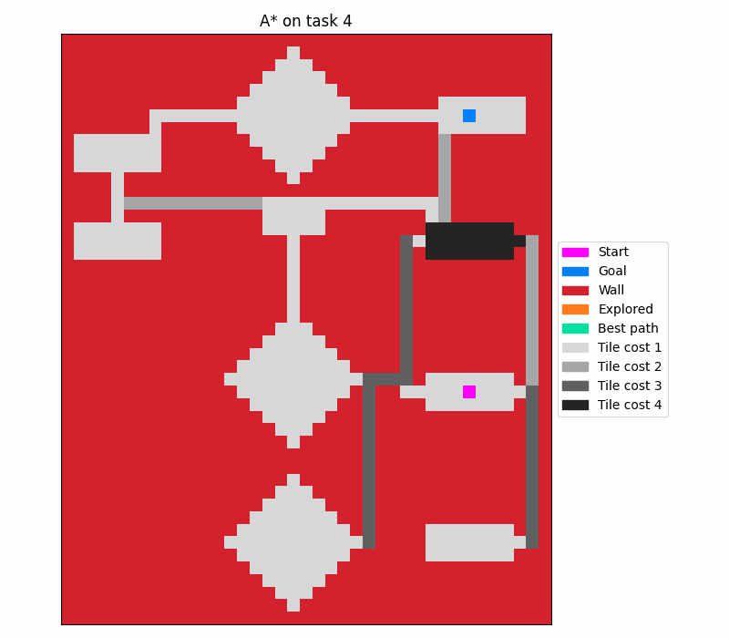

## Applying the A* Algorithm

**Purpose:** Gain hands-on experience with best-first search using the A*
algorithm.

Project requires the pipenv package and python 3+. 
To run the project, first install all required packages by running:

`pipenv install -r requirements.txt`

Then simply run the main.py file run the A* algorithm.

There are three different tasks, each with a corresponding map, start and goal position.
Running the main.py file solves all the tasks and generates gifs that represent the corresponding search-process.

### Task 1

In task 1 all the arc-costs were constant.

### Task 2

Task 2 is the same as task 1, just with different start- and goal positions.

### Task 3

The map used in task 3 has varying arc-costs. 

### Task 4

Similar to task 3, but with more extreme arc-costs.

